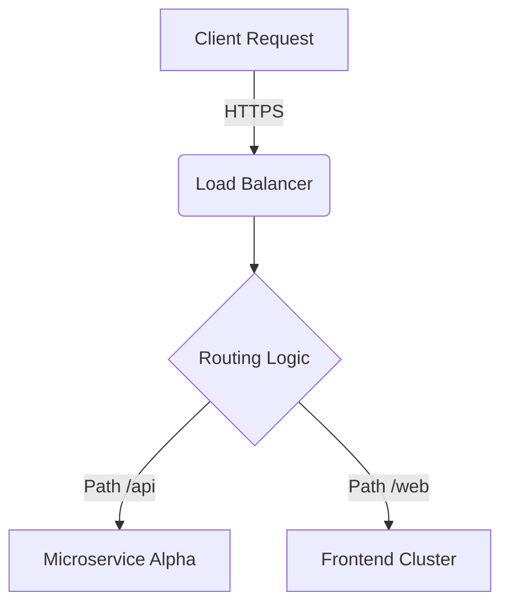

# 🏷️ Advanced Markdown Master Showcase: Title (H1)

> **Pro-Tip:** Blockquotes are ideal for highlights, tips, or warning callouts. You can nest **formatting** like bold text, `inline code`, or even sub-quotes inside them.
>
>> *Nested quotes look like this, giving a clean hierarchical structure.*

This document acts as an exhaustive reference sheet showcasing the full syntactic capability of Markdown.

---

## 📌 1. Structural Headers & Navigation (H2)

Headers establish your document's hierarchy. Use them sequentially from `##` down to `######`.

### Structural Sub-heading (H3)
#### Detailed Section (H4)
##### Micro-section (H5)
###### Deepest Spec Section (H6)

---

## 📝 2. Inline Text Formatting & Typography

Express emphasizing or stylizing text natively:

*   This text is **bolded using double asterisks** or __double underscores__.
*   This text is *italicized using single asterisks* or _single underscores_.
*   Combine them to create ***bold and italicized text***.
*   Use ~~strikethrough~~ to signal deleted, deprecated, or updated content.
*   Highlight crucial mathematical variables with superscripts like E = mc² or subscripts like H₂O.
*   Keyboard shortcuts can be wrapped in html tags like <kbd>Ctrl</kbd> + <kbd>C</kbd>.

---

## 💻 3. Code Blocks & Syntax Highlighting

Inline code can be declared seamlessly by using single backticks: `const user = "Alex";`. 

For blocks of code, use triple backticks combined with an explicit **language identifier** to trigger context-aware syntax highlighting:

```typescript
// Example of a TypeScript interface and class
interface User {
  id: number;
  username: string;
  isActive: boolean;
}

export class Authentication {
  public verify(user: User): boolean {
    console.log(`Checking status for: ${user.username}`);
    return user.isActive;
  }
}
```

You can also showcase terminal configurations or command line interactions:
```bash
$ npm install dotenv --save-dev
$ npm run dev
```

---

## 📊 4. Complex Data Tables

Tables are excellent for structured data alignment. Use colons (`:`) inside the separator row to dictate text alignment properties:

| Feature Name | Status | Type | Performance Rating |
| :--- | :---: | :---: | ---: |
| Native Markdown | 🟢 Production | Core Syntax | `10/10` |
| HTML Embedding | 🟡 Partial | Extended | `7/10` |
| Mermaid Diagrams | 🔵 Extension | Plugin-reliant | `9.5/10` |
| Custom Inline CSS | 🔴 Unsupported | Strict Environment | `0/10` |

---

## 🗂️ 5. Lists: Unordered, Ordered, and Task Lists

### Unordered Bullet Points (Nested)
- **Primary Core Component**
  - Secondary structural item
    - Sub-detail with deep nesting capabilities
- **Secondary Core Component**

### Sequential Ordered Lists
1. **First step:** Initialize the environment configuration.
2. **Second step:** Provision the underlying database instances.
3. **Third step:** Execute test matrices sequentially.
   1. Sub-step validation phase A
   2. Sub-step validation phase B

### Interactive Task Checklists
- [x] Integrate primary web framework dependencies
- [x] Configure production environment secrets
- [y] Draft initial onboarding document architecture
- [ ] Implement system-wide end-to-end integration tests

---

## 🔗 6. Hyperlinks, References, and Media Anchors

### Direct and Named Hyperlinks
*   Visit the official [CommonMark Specification Hub](https://commonmark.org) for formatting rules.
*   Hover over this [Spec Link](https://commonmark.org "CommonMark Documentation Homepage") to view the contextual tooltip.

### Reference-Style Links
This style keeps raw text incredibly clean. You declare links inside text like [Reference Site 1][ref1] or [Reference Site 2][ref2], then define the actual destination anchors cleanly at the very bottom of your document structure.

### Inline Media & Images
Adding images uses the same syntax as hyperlinks, prefixed by an exclamation mark (`!`):


---

## 🧬 7. Advanced Extended Syntax (Mermaid & Math)

*Note: The features below require parsers like GitHub, GitLab, or Obsidian to render visually.*

### Mathematical Expressions via LaTeX
When validating complex formulas, wrap LaTeX markdown inside single dollar signs for inline expressions like \(a^2 + b^2 = c^2\), or double dollar signs for standalone blocks:

\[\sum_{i=1}^{n} i = \frac{n(n+1)}{2}\]

### Dynamic Vector Diagrams via Mermaid
Generate complex software architecture charts, flowcharts, or sequences natively using plain-text strings:



---

[ref1]: https://github.com
[ref2]: https://github.io
